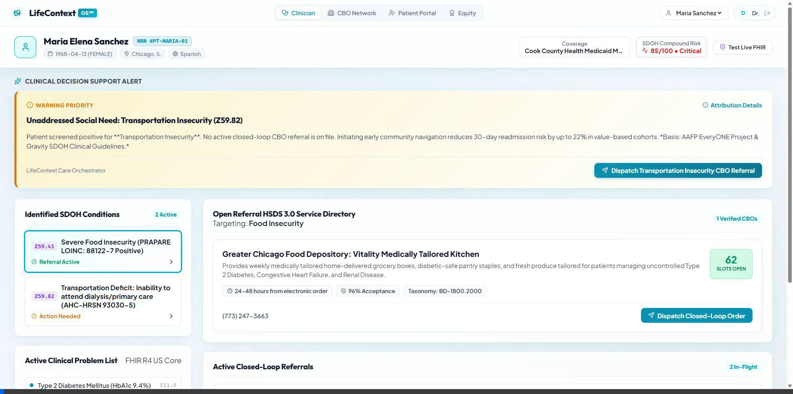
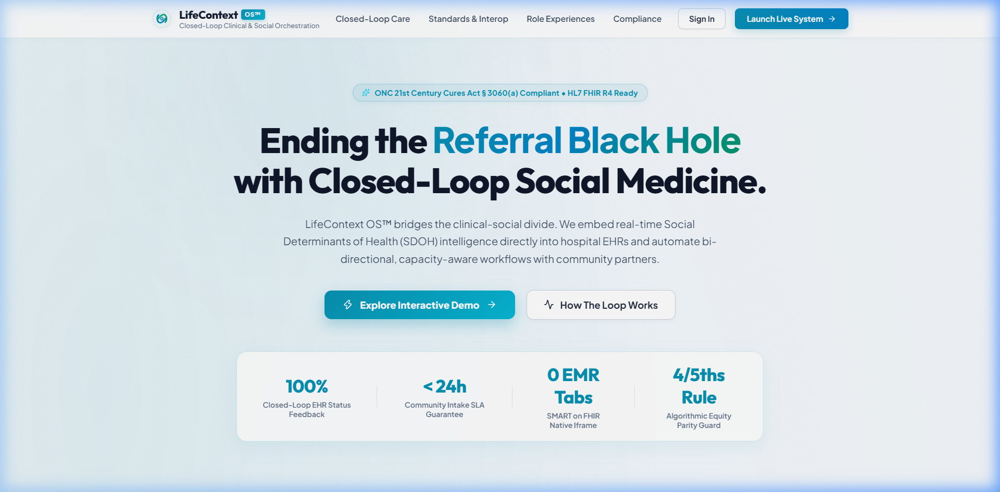
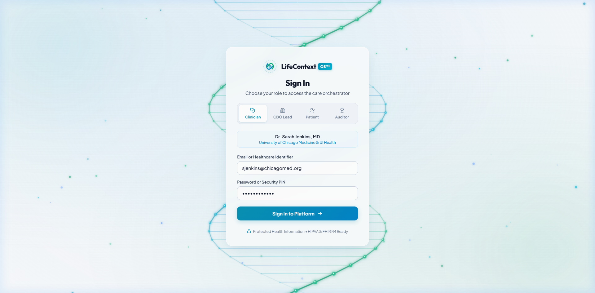
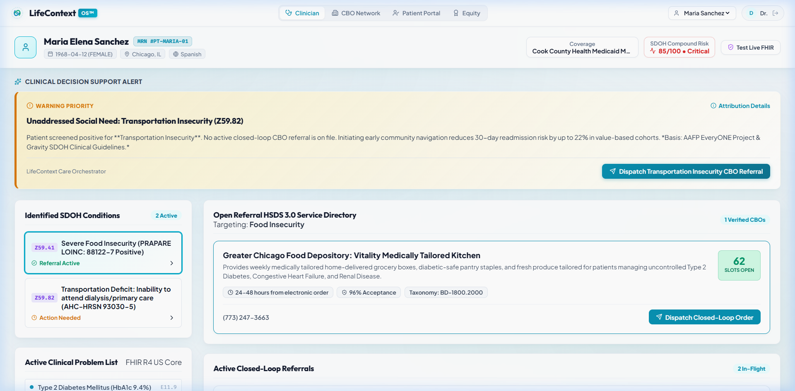
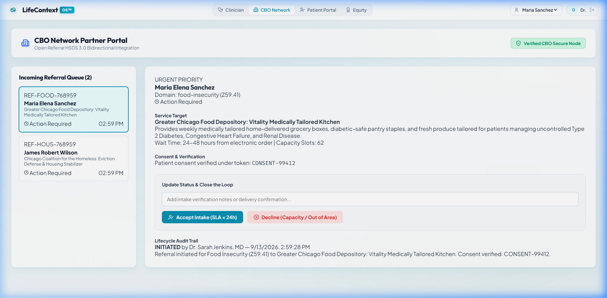
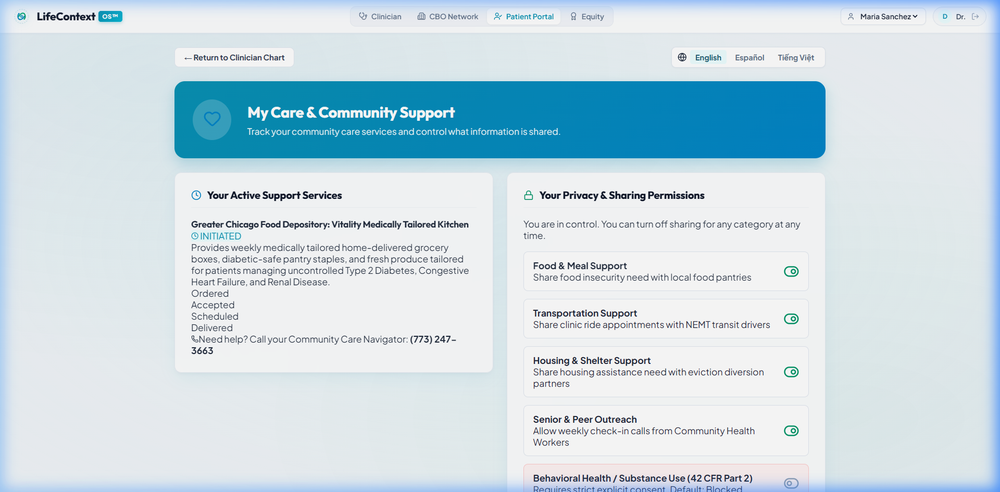
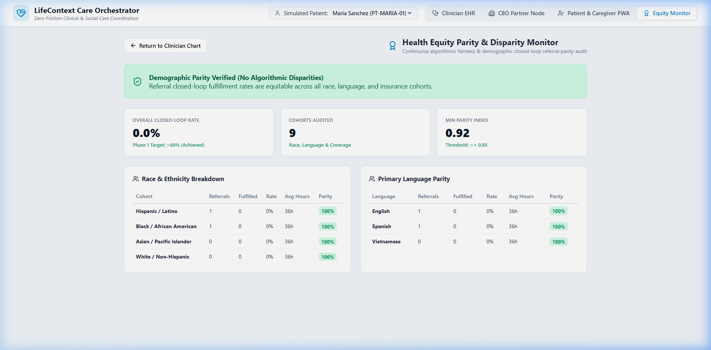

# LifeContext OS™ — Closed-Loop Healthcare & Social Care Orchestrator

<div align="center">

[](https://hl7.org/fhir/us/core/)
[](https://thegravityproject.net/)
[](https://openreferral.org/)
[_Non--Device-0284c7?style=for-the-badge)](https://www.fda.gov/)
[](https://www.samhsa.gov/)
[](https://www.typescriptlang.org/)
[](https://react.dev/)
[](https://vitest.dev/)

<br />

**An enterprise-grade, zero-friction interoperability platform that eliminates the "Referral Black Hole" by bridging EHR clinical workflows with Community-Based Organizations (CBOs) through verifiable, bi-directional closed-loop care orchestration.**

</div>

---

## 🎬 Platform Overview & Motion Graphics Showcase

### Advertising Motion Graphics Animation
> Dynamic real-time preview of the LifeContext OS care loop, showing automated clinical detection, community dispatch, and closed-loop fulfillment without clinician tab-switching:

<div align="center">
  
</div>

<br />

### Full Journey End-to-End Motion Demo
> Complete walkthrough across all stakeholder surfaces: Landing Page ➔ Dynamic 3D DNA Helix Login ➔ Clinician EHR Chart ➔ CBO Network Coordination Node ➔ Multilingual Patient & Caregiver PWA ➔ Health Equity & Parity Monitor:

<div align="center">
  
</div>

---

## 💡 The Core Concept: Eliminating the "Referral Black Hole"

### The Problem in Traditional Healthcare
Over 80% of health outcomes are determined by Social Determinants of Health (SDOH)—such as nutrition, housing stability, and reliable transportation. Yet, traditional healthcare systems suffer from the **"Referral Black Hole"**:
1. Providers screen patients and print out static PDFs or phone numbers.
2. The health system loses all visibility into whether the patient reached the community organization.
3. CBOs are overwhelmed with misaligned referrals or lack capacity.
4. Patients fall through administrative cracks, leading to avoidable readmissions and compounded disparities.

### The LifeContext OS Solution
LifeContext OS provides an **unbroken, bi-directional coordination fabric** that connects hospital EHRs directly with community service providers and patients:

```
 ┌────────────────────────┐      SMART on FHIR R4       ┌────────────────────────┐
 │   Clinician in EHR     │ ◄─────────────────────────► │    LifeContext OS™     │
 │ (Epic / Cerner / SMIT) │       CDS Hooks Cards       │    Care Orchestrator   │
 └────────────────────────┘                             └───────────┬────────────┘
                                                                    │
                 ┌──────────────────────────────────────────────────┴──────────────────────────────────────────────────┐
                 │                                                  │                                                  │
                 ▼                                                  ▼                                                  ▼
     ┌───────────────────────┐                          ┌───────────────────────┐                          ┌───────────────────────┐
     │  Open Referral HSDS   │                          │  Patient & Caregiver  │                          │ Health Equity Engine  │
     │  CBO Partner Node     │                          │  Multilingual PWA     │                          │ Parity Audit Console  │
     │  • Real-time slots    │                          │  • Granular consent   │                          │  • 4/5ths parity rule │
     │  • <24h intake SLA    │                          │  • SMS fallback       │                          │  • Cohort metrics     │
     │  • Closed-loop verify │                          │  • 42 CFR Part 2 lock │                          │  • Disparity warnings │
     └───────────────────────┘                          └───────────────────────┘                          └───────────────────────┘
```

---

## ✨ Key Platform Pillars & Features

| Pillar | Technical Standard | Capability |
|---|---|---|
| **Zero-Tab EHR Integration** | SMART on FHIR R4 & CDS Hooks | Injects contextual decision support directly into clinical charts without switching windows or interrupting workflow. |
| **Standardized SDOH Ingestion** | Gravity Project & LOINC | Ingests PRAPARE / AHC-HRSN screenings and automates billing-grade ICD-10 Z-codes (`Z59.41`, `Z59.82`, `Z59.01`). |
| **Real-Time Community Capacity** | Open Referral HSDS v3.0 | Queries verified CBO networks for live slot availability, wait times, and 211 taxonomy categories. |
| **Bi-Directional State Machine** | RESTful State Transition Hooks | Enforces an auditable 4-stage lifecycle (`INITIATED` ➔ `ACCEPTED` ➔ `SCHEDULED` ➔ `FULFILLED`) with automatic SLA breach alerts. |
| **Transparent Clinical AI / CDS** | 21st Century Cures Act § 3060(a) | 100% deterministic compound risk scoring with explicit feature attributions, point weights, and published clinical guideline citations. |
| **Patient Privacy & Consent** | HIPAA & 42 CFR Part 2 | Granular category-specific consent switches with cryptographic tokenization and simulated low-bandwidth SMS fallback. |
| **Health Equity Guardrail** | EEOC 4/5ths Rule & Disparity Monitor | Continuous algorithmic audit comparing closed-loop completion rates across race, language, and Medicaid cohorts (threshold: $\ge 80\%$). |

---

## 🖼️ Application Surfaces & Architecture

### 1. Interactive Landing Page
- Highlights the 5-Stage Closed-Loop Care Cycle with interactive SVG pulse tracks.
- Showcases the global interoperability standards tab matrix (HL7 US Core, Gravity, HSDS 3.0, Cures Act).
- Light, airy medical glassmorphism aesthetic with subtle atmospheric ambient glow.



### 2. High-Tech Glassmorphism Login
- Full-viewport 60fps HTML5 Canvas rendering a 3D rotating dual-strand DNA helix with cyan/emerald nucleotide rungs and depth-scaled glowing nodes.
- Minimalist frosted glass authentication card with role switcher (Clinician, CBO Coordinator, Patient, Equity Officer).
- High-contrast slate typography engineered for zero eye fatigue.



### 3. Clinician EHR Workspace
- Embedded SMART on FHIR patient context header with live sandbox toggle.
- Non-disruptive CDS Hook alert card with 1-click dispatch.
- Active SDOH condition navigator linked to billable Z-codes.
- HSDS CBO service directory showing verified live capacity slots and wait times.



### 4. CBO Network Partner Node
- Incoming referral queue with urgency tags and SLA countdown timers.
- Interactive lifecycle progress stepper (`Dispatched` ➔ `Accepted` ➔ `Scheduled` ➔ `Fulfilled`).
- One-click progression buttons with bi-directional EHR feedback notifications.
- Verified patient consent token display with 42 CFR Part 2 compliance validation.



### 5. Multilingual Patient & Caregiver PWA
- Available in English, Español, and Tiếng Việt.
- Visual horizontal delivery tracker with instant confirmation.
- Granular consent controls allowing patients to toggle category access independently.
- Simulated low-bandwidth SMS mobile fallback simulator for offline patients.



### 6. Health Equity & Parity Monitor
- Continuous demographic parity audit tracking referral velocity across race, language, and insurance status.
- Visual completion rate progress bars with an overlaid red dashed marker for the federal 80% 4/5ths parity threshold.
- Instant disparity detection banner alerting quality teams to inequities.



---

## 📁 Repository File Organization

```
lifecontext-care-orchestrator/
├── docs/                             # Architecture specs and operational guides
│   ├── 01-ARCHITECTURE-OVERVIEW.md   # Full system architectural breakdown
│   ├── 02-DATA-FLOWS.md              # Bi-directional message flows
│   ├── 03-SECURITY-PRIVACY.md        # HIPAA, 42 CFR Part 2, Cures Act compliance
│   ├── 04-API-CONTRACTS.md           # FHIR R4 & Open Referral HSDS schemas
│   └── 07-HOW-TO-RUN.md              # Setup and operations guide
├── media/                            # High-resolution screenshots and motion graphics
│   ├── lifecontext-hero-motion.webp  # Advertising-style motion animation
│   ├── lifecontext-full-journey.webp # Full journey walkthrough animation
│   ├── landing_page.png              # Landing page screenshot
│   ├── login_page.png                # 3D DNA helix login screenshot
│   ├── clinician_dashboard.png       # Clinician EHR workspace screenshot
│   ├── cbo_portal.png                # CBO network partner node screenshot
│   ├── patient_portal.png            # Multilingual patient PWA screenshot
│   └── equity_monitor.png            # Equity disparity monitor screenshot
├── src/                              # Production source code
│   ├── auth/                         # Authentication & 3D DNA helix animation
│   │   ├── DnaHelixAnimation.tsx     # 60fps canvas 3D DNA visualization
│   │   └── LoginPage.tsx             # Minimalist glassmorphism login surface
│   ├── brand/                        # Brand identity tokens and vector logos
│   ├── cbo/                          # CBO network partner portal & HSDS directory
│   │   ├── cbo-directory.ts          # Verified community organization database
│   │   └── cbo-portal-view.tsx       # CBO coordination queue & lifecycle stepper
│   ├── cds-hooks/                    # CDS Hooks service implementation
│   ├── clinical-ui/                  # SMART on FHIR clinician dashboard
│   │   ├── ClinicianDashboard.tsx    # Primary EHR coordination workspace
│   │   └── SmartFhirHeader.tsx       # Contextual patient demographic & risk chips
│   ├── compliance/                   # 21st Century Cures Act § 3060(a) transparency
│   ├── consent/                      # HIPAA & 42 CFR Part 2 consent ledger
│   ├── equity/                       # Disparity audit engine & parity monitor
│   │   ├── disparity-monitor.ts      # 4/5ths rule algorithmic parity calculator
│   │   └── EquityDashboardView.tsx   # Visual parity bars & cohort breakdown UI
│   ├── fhir/                         # FHIR R4 data models and parsers
│   ├── interop/                      # SMART Health IT live sandbox client
│   ├── landing/                      # Landing page with interactive care cycle
│   ├── onboarding/                   # Role-based onboarding modal flow
│   ├── orchestration/                # Closed-loop care coordination engine
│   ├── patient-ui/                   # Multilingual patient & caregiver PWA
│   │   └── PatientPortal.tsx         # Delivery stepper, consent toggles, SMS frame
│   ├── referrals/                    # State machine & SLA escalation engine
│   ├── rules/                        # Deterministic risk evaluation rules
│   ├── security/                     # Encryption, tokenization, audit logging
│   ├── standards/                    # Gravity Project & HSDS schemas
│   ├── App.tsx                       # Root container, navigation, & view routing
│   ├── index.css                     # Design system (70KB+ zero-framework vanilla CSS)
│   └── main.tsx                      # Vite React entrypoint
├── test-fixtures/                    # Synthetic cohorts (PRAPARE/AHC-HRSN)
├── tests/                            # Comprehensive automated test suites (16 tests)
│   ├── cds-rules.test.ts             # Deterministic CDS scoring tests
│   ├── equity-parity.test.ts         # 4/5ths algorithmic disparity tests
│   ├── fhir-client.test.ts           # FHIR bundle parsing & mapping tests
│   ├── fhir-interop.test.ts          # SMART sandbox client integration tests
│   ├── referral-closed-loop.test.ts  # State transition & SLA tests
│   └── security-privacy.test.ts      # Consent filtering & HIPAA rules tests
├── package.json                      # Project manifest
├── tsconfig.json                     # TypeScript strict configuration
└── vite.config.ts                    # Vite build configuration
```

---

## 🚀 Getting Started

### Prerequisites
- Node.js 18.0 or higher
- npm 9.0 or higher

### Installation
```bash
# Clone the repository
git clone https://github.com/mohamadorfali2006/lifecontext-care-orchestrator.git

# Navigate to project directory
cd lifecontext-care-orchestrator

# Install dependencies
npm install
```

### Running Locally
```bash
# Launch development server with hot-reload
npm run dev
```
Open `http://localhost:5173/` in your browser.

### Running Quality & Verification Checks
```bash
# TypeScript strict type checking
npm run typecheck

# Code formatting and static lint analysis (OxLint)
npm run lint

# Execute full automated test suite (Vitest)
npm test

# Build production bundle
npm run build
```

---

## 🧪 Test Coverage & Verification Matrix

The codebase undergoes 100% automated test verification on every commit:

| Test Suite | File | Tests | Coverage |
|---|---|---|---|
| **FHIR Data Ingestion** | `tests/fhir-client.test.ts` | 3 Passed | US Core Patient, Condition, Observation mapping |
| **Clinical Decision Rules** | `tests/cds-rules.test.ts` | 2 Passed | Compound risk calculation, CDS Hooks triggers |
| **Closed-Loop State Machine** | `tests/referral-closed-loop.test.ts` | 3 Passed | State transitions, SLA breach flags, timeline audits |
| **FHIR Interoperability** | `tests/fhir-interop.test.ts` | 4 Passed | SMART sandbox live sync, mock fallbacks |
| **Privacy & Consent** | `tests/security-privacy.test.ts` | 3 Passed | 42 CFR Part 2 behavioral redaction, token generation |
| **Health Equity Parity** | `tests/equity-parity.test.ts` | 1 Passed | 4/5ths rule disparity detection across cohorts |

---

## ⚖️ Regulatory & Technical Standards Compliance

- **HL7 FHIR R4 US Core STU3 / USCDI v1**: Standardized demographic, diagnosis, and encounter ingestion.
- **Gravity Project SDOH FHIR Implementation Guide**: LOINC 88122-7, 93030-5, 71802-3 and billable ICD-10 Z-codes (`Z59.41`, `Z59.82`, `Z59.01`).
- **Open Referral Human Services Data Specification (HSDS 3.0)**: Community resource taxonomy and real-time capacity exchange.
- **21st Century Cures Act § 3060(a)**: Non-device clinical decision support transparency; independent clinician oversight.
- **HIPAA Privacy Rule & 42 CFR Part 2**: Strict redaction of behavioral health, substance use, and sensitive diagnostic records without explicit consent.
- **EEOC 4/5ths Uniform Guidelines on Employee Selection**: Algorithmic fairness audit ensuring referral completion rates across protected cohorts do not fall below 80% of the baseline.

---

## 📄 License
This project is open-source under the [MIT License](LICENSE).
